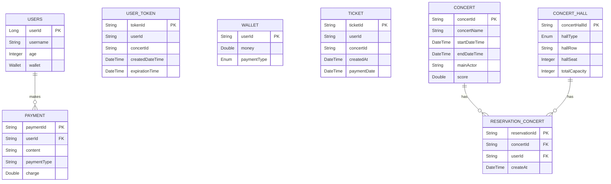

## erd

```mermaid
erDiagram

    USERS {
    Long userId PK
    String username
    Integer age
    Wallet wallet
    }

    USER_TOKEN {
        String tokenId PK
        String userId 
        String concertId 
        DateTime createdDateTime
        DateTime expirationTime
    }

    PAYMENT {
        String paymentId PK
        String userId FK
        String content
        String paymentType
        Double charge
    }

    WALLET {
        String userId PK
        Double money
        Enum paymentType
    }

    TICKET {
        String ticketId PK
        String userId 
        String concertId 
        DateTime createdAt
        DateTime paymentDate
    }

    CONCERT {
        String concertId PK
        String concertName
        DateTime startDateTime
        DateTime endDateTime
        String mainActor
        Double score
    }

    CONCERT_HALL {
        String concertHallId PK
        Enum hallType
        String hallRow
        Integer hallSeat
        Integer totalCapacity
    }

    RESERVATION_CONCERT {
        String reservationId PK
        String concertId FK
        String userId FK
        DateTime createAt
    }

    %% Relationships
    USERS ||--o{ PAYMENT : "makes"
    CONCERT ||--o{ RESERVATION_CONCERT : "has"
    CONCERT_HALL ||--o{ RESERVATION_CONCERT : "has"
```
