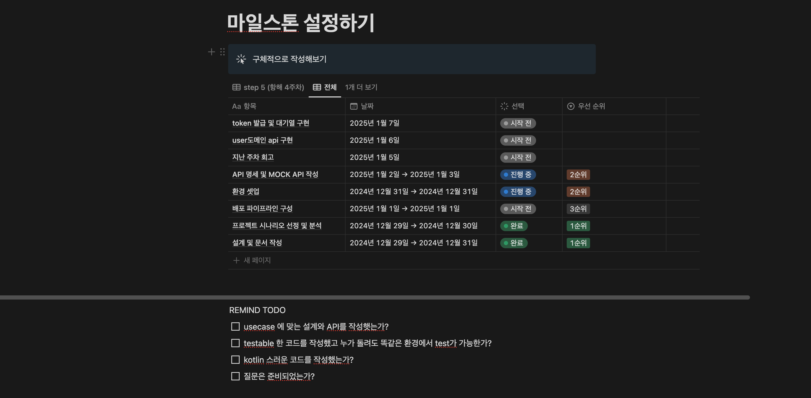

# 마일스톤 설정하기

<aside>
 명확하고 구체적인 목표를 설정하면 방향을 정하고 집중력을 유지하는 데 도움이 됩니다!  이 페이지를 사용해 목표를 명확히 정의하고, 달성 방법과 일정을 계획해 보세요. 우선 순위를 설정해 업무의 처리 순서를 정할 수도 있어요.

</aside>

REMIND TODO 

- [ ]  usecase 에 맞는 설계와 API를 작성햇는가?
- [ ]  testable 한 코드를 작성했고 누가 돌려도 똑같은 환경에서 test가 가능한가?
- [ ]  kotlin 스러운 코드를 작성했는가?
- [ ]  질문은 준비되었는가?

# 참조

**노션링크**

https://www.notion.so/16bada86701981eaa79dd81867ca44ec?pvs=4