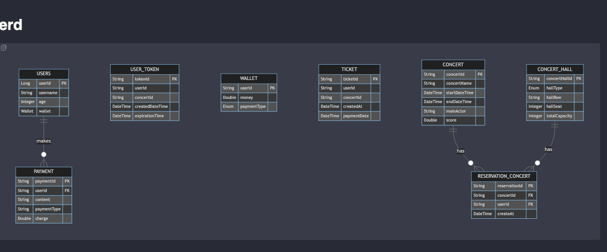

# step 6

# 요구사항

- ERD 설계 자료 제출
- API 명세 및 Mock API 작성
- Git Repo 제출

# ERD

- user는 payment와 릴레이션을 가진다.
  -> payment 이외의 wallet은 valueObject , token은 id만 가지는 논리적 연관관계로 해석하였습니다.
  -> 객체간의 생명주기를 고려했을때 ticket 같은 경우도 연관관계가 필요할수 있다 생각했었지만,
  연관관계가 많아지면 복잡도가 높아진다 판단되어 보류하였습니다.
- concert정보와 concertHall 과의 관계가 양방향이라 생각해서 schedule이라는 중간테이블을 두어 연관관계를 해결하고자 하였습니다.
  -> concert 예약에 대한 history 관리

# mock API

- test 하였던 postman json 파일을 첨부하였습니다.

# 프로젝트 소개

- 프로젝트 구조는 src_structure.md 라는 이름으로 docs 패키지 하위에 있습니다.
- 콘서트 예약은 크게 concert 라는 도메인과 user라는 도메인이 주체가 된다 판단되어 두가지 aggregate로 구성하였습니다.